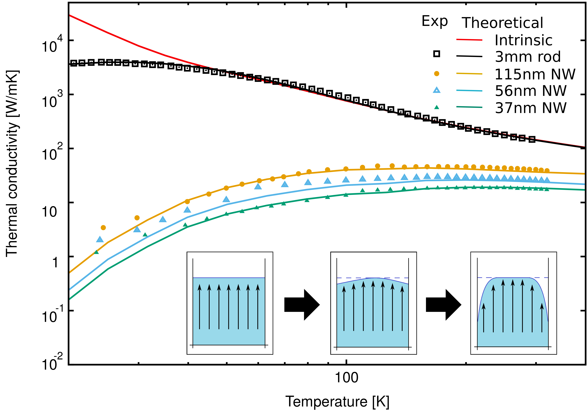

### KCM hydodynamic equation in finite element simulations

In recent years the [nanoTransport Group](http://grupsderecerca.uab.cat/nanotransport/en){:target="_blank_"} of Universitat Autònoma de Barcelona 
has been developing a theoretical framework to study thermal transport at the nanoscale in complex devices. While simple 
geometries like nanowires or thin films can be predicted from classical models with effective parameters or suppression
functions, complex geometries of real devices requires more specific treatment. The direct solution of the BTE in such cases
is of high complexity and computationally unachievable nowadays. The hydrodynamic model proposed by the
[nanoTransport Group](http://grupsderecerca.uab.cat/nanotransport/en){:target="_blank_"} is providing good agreement with experimental
setups in collaboration with the [Quantum Engineered Systems & Technology](https://nanohub.org/groups/quest/){:target="_blank_"} group from Purdue University.

The implementation of the KCM hydrodynamic equation:

 &part;&tau;/&part;t + <b>q</b>
 = -&kappa;<b>&nabla;</b>T+&ell;2(&nabla;2<b>q</b>+2<b>&nabla;</b>&nabla;<b>q</b>) ,

(1)

requires to obtain the bulk parameters &kappa; and <math>&ell;2</math> from <i>first principles</i>
simulations (see [USER GUIDE-INPUT FILE](https://physta.github.io/input_file/)). The default output file will inculde such parameters.

The <b>Eq.1</b> needs to be implemented in a finite elements simulator as [ANSYS](http://www.ansys.com/){:target="_blank_"} or [COMSOL](https://www.comsol.com){:target="_blank_"} in 1D, 2D or 3D.

The boundary effects in the hydrodynamic model are introduced defining the flux at the boundaries as:

 <b>qB</b> = C &part;<b>q</b>/&part;<b>r</b> ,

(2)

At the moment the hydrodynamic KCM equation is not publicly included in any finite elements software to be used for regular users. 
You will have to write the equation by yourself or ask <a href="mailto:{{ "pol.torres@uab.cat" }}" title="Email me" target="_blank">us</a> for collaboration.

