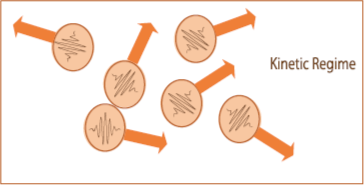
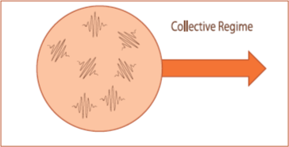

### The Kinetic Collective Model

The [Kinetic Collective Model](http://aip.scitation.org/doi/10.1063/1.4871672){:target="_blank_"} (KCM) developed in recent years improve the solution provided under the classical RTA.
The model, derived from the exact solution of the LBTE proposed by [Guyer and Krumhansl](https://journals.aps.org/pr/abstract/10.1103/PhysRev.148.766){:target="_blank_"},
is based on the splitting of the collision operator in normal and resistive processes (<b>C = N + R </b>) when calculating the scattering matrix.
As normal processes does not contribute directly to thermal resistance but redistribute momentum over all the phonon distribution,
a suitable way to solve the LBTE is by using the basis that diagonalizes the normal scattering collision operator.
This diagonalization allows to solve the BTE without complicating drastically the form of the drift operator.

The splitting of the collision operator allows to split the thermal conductivity in two contributions, kinetic and collective, 
weighed by a switching factor &Sigma; :

&kappa; = (1-&Sigma;)&kappa;&lowast;K + &Sigma;&kappa;&lowast;C = &kappa;K + &kappa;C ,

(1)
 

where &Sigma;=(1+<math>&langle;</math>&tau;N<math>&rangle;</math> / <math>&langle;</math>&tau;R<math>&rangle;</math>)-1. &Sigma; &isin; [0,1] measures the relative importance of the <i>N versus R</i> phonon scattering. <math>&langle;</math>&tau;<math>&rangle;</math> represents a temperature dependent averaged relaxation time. While &kappa;&lowast; is the limit thermal conductivity in each regime, &kappa;K and ;&kappaC are the actual contributions to thermal conductivity weighed by &Sigma;. In the current version of `KCM.py` are implemented the contributions that maximizes the entropy in each regime as defined [here](https://doi.org/10.1063%2F1.4871672){:target="_blank_"}:

&kappa;&lowast;K=&sum;iCivi&otimes;vi&tau;i 

(2)

<table class="fraction" align="center" cellpadding="0" cellspacing="0"><tr><td>

&kappa;&lowast;C=
</td>
 <td> 

&sum;iCiviqi&otimes;&sum;iCiviqi
 
&sum;iCiqi2/(&#8463;&omega;)2&tau;i-1

  
</td>
</tr>
</table>
 
(3)

{:width="350px"} {:width="350px"}

In the kinetic regime, each phonon behave independently, but in the collective regime, due to the effect
of <i>N</i> collisions appears a coupling between phonons. Therefore phonons of different modes perform as a whole
resistive collisions and share the same collision mean free time (MFT), the so-called collective MFT &tau;c.
In analogy with the definition of the thermal conductivity, the total phonon relaxation time can be defined from the
kinetic or resistive MFT &tau;K and the collective MFT &tau;C as:

&tau; = (1-&Sigma;)&tau;&lowast;K + &Sigma;&tau;&lowast;C = &tau;K + &tau;C .
 
(4)

For a full understanding of the KCM look at [REFERENCES](https://physta.github.io/articles/).

### Hydrodynamic heat transport in KCM 

Since more than 10years ago the [nanoTransport Group](http://grupsderecerca.uab.cat/nanotransport/en){:target="_blank_"} has been working in heat hydrodynamics and
its applications to study nanoscale systems (see [REFERENCES](https://physta.github.io/articles/)).

As pointed out previously, using the basis that diagonalizes the normal scattering collision operator 
allows to study the drift operator in a simple way to higher orders, leading to an hydrodynamic equation beyond Fourier:

 &part;&tau;/&part;t + <b>q</b>
 = -&kappa;<b>&nabla;</b>T+&ell;2(&nabla;2<b>q</b>+2&nabla;&nabla;<b>q</b>) ,

(5)

where <math>&ell;</math> is the non-local length (NL-param). From [Guyer and Krumhansl](https://journals.aps.org/pr/abstract/10.1103/PhysRev.148.766){:target="_blank_"} it is studied
the limiting case where normal proceses dominate,  &tau;N<<&tau;R. In this limit, corresponding
to the collective regime, the NL-param is <math>&ell;2C&lowast;=&langle;v2&tau;N&rangle;&langle;&tau;C&rangle;</math>.

To have a global equation, in the KCM framework has been studied the kinetic limit &tau;N>>&tau;R,
leading to <math>&ell;2K&lowast;=&langle;v2&tau;R&rangle;&langle;&tau;R&rangle;</math>. This generalization allows to define a total non-local length as:

&ell;2 = (1-&Sigma;)&ell;2K&lowast; + &Sigma;&ell;2C&lowast; = &ell;2K + &ell;2C .

(6)

This extension of the Guyer and Krumhansl equation done in the KCM framework leads to the so-called hydrodynamic KCM equation (<b>Eq.5</b>).
This equation, together with suitable boundary conditions, can be implemented for finite elements simulations to study thermal 
properties in complex geometries (see [FINITE ELEMENTS](https://physta.github.io/finite_elements/)).
